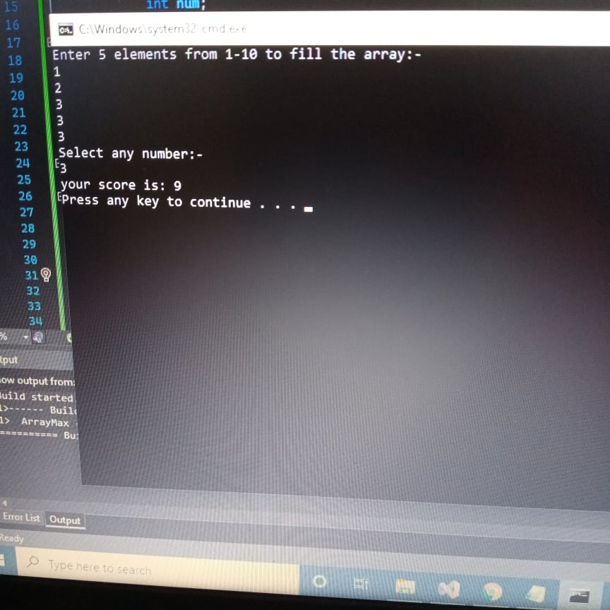
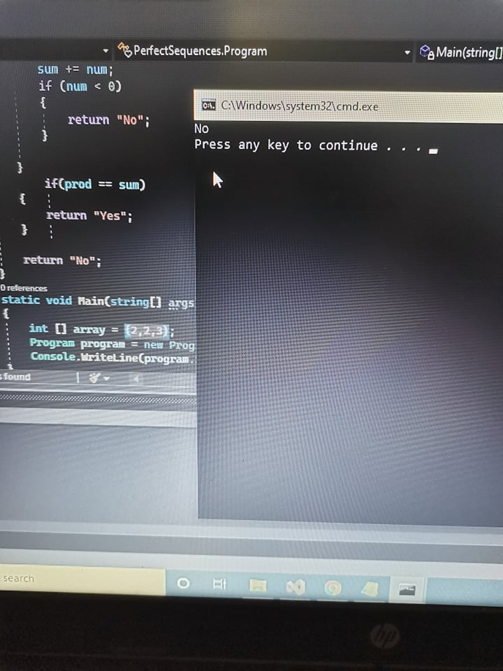
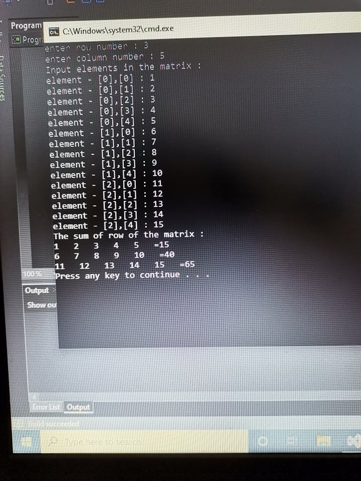

# Prework-CodeChallenges
#### Problem 1: Array Max Result
##### instructions
* declare array 
* ask user to enter elements to fill the array
* loop among elements
* ask user to select a number
* count this number occurences and multiply with num 

##### results

#### Problem 2: Leap Year Calculator 
##### instructions
* ask user to enter year
* read input
* condition if year divisable by 4,100,400 the year considered as leap year and return yes else return no
##### results

#### Problem 3: Perfect Sequence

##### instructions
* define array
* loop among this array
* perfect sequence is a sequence such that all of its elements are non-negative integers and the product of all of them is equal to their sum
* conditions for the sequence
* return “Yes” if the sequence is considered a perfect sequence. Otherwise, return “No”

##### results

#### Problem 4: Sum of Rows

##### instructions
* define array 
* let user enter rows number
* let user fill the columns number
* let user fill the array according to rows and columns
* define a variable to count sum for each row (loop among rows) and save the values in a variable
##### results
