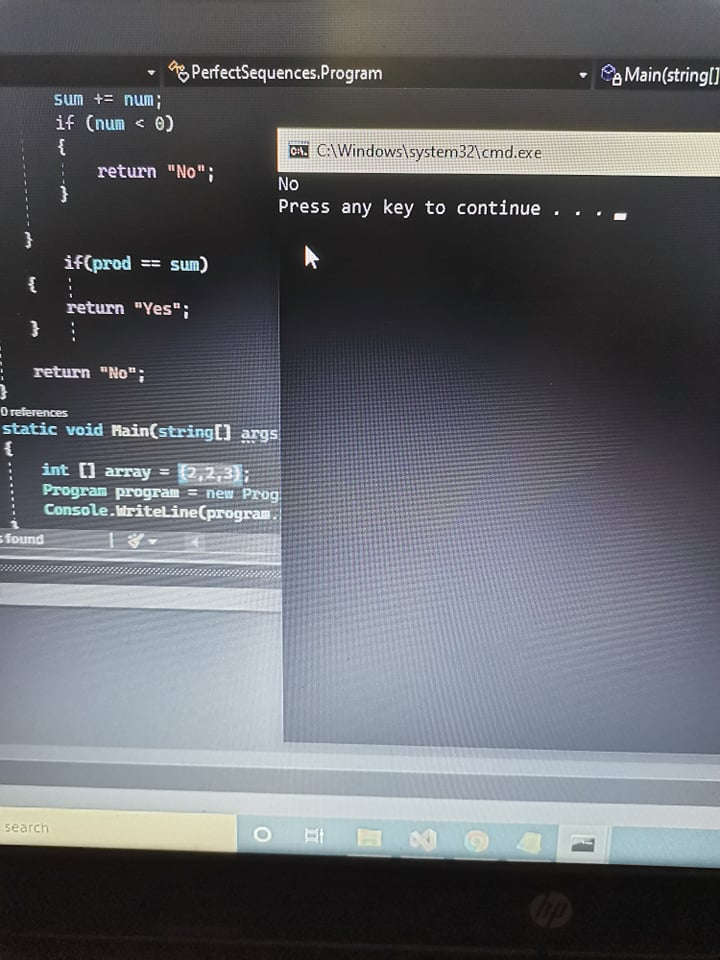
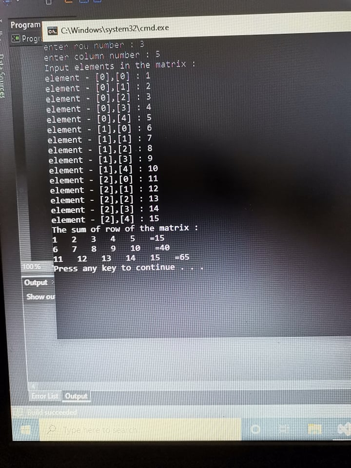

#### Problem 1: Array Max Result
##### Create a Console application that requests 5 numbers between 1-10 from the user. Output the array to the console and ask the user to select a number. After the selection, output the “score” of the number chosen.

##### results

#### Problem 2: Leap Year Calculator 
##### Given a year, report if it is a leap year.

##### results

#### Problem 3: Perfect Sequence
##### Given an array, return “Yes” if the sequence is considered a perfect sequence. Otherwise, return “No”

Perfect Sequences
A perfect sequence is a sequence such that all of its elements are non-negative integers and the product of all of them is equal to their sum. For example: [2,2], [1,3,2] and [0,0,0,0] are perfect sequences and [4,5,6] and [0,2,-2] are not perfect sequences. Negative numbers of any kind are not valid in a perfect sequence

##### results

#### Problem 4: Sum of Rows
##### Given a matrix of integers. Return the sum of each row in a single dimensional array.

##### results
